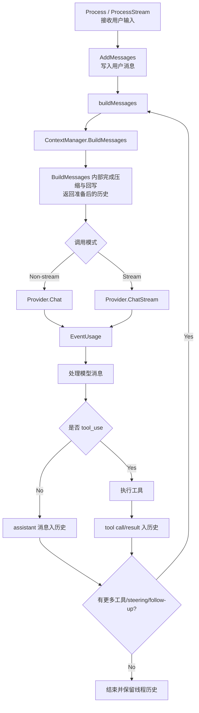

# Context Manager 设计总结

## 目标

统一管理 Agent 会话上下文：

- 消息管理从 Agent 解耦，支持可替换实现
- 支持叠加上下文策略（压缩、摘要）
- 支持跨重启持久化

## 核心能力

- 消息读写与清理
- 推理前上下文准备（可触发压缩、注入摘要）
- 状态快照与持久化

## Agent 流程

## 实现策略

### SimpleContextManager

- 纯内存存储，管理单一会话历史
- 不做压缩，透传历史
- 作为默认实现或其他策略的底座

### PersistentContextManager

装饰器模式，可嵌套组合多层策略。

**压缩触发条件**：
- 消息 token 总量超过软阈值（默认 120k）
- 且消息数超过保留数量的一半

**压缩策略**：
- 保留最近 N 条消息（默认 80 条）
- 被裁剪的历史生成摘要，追加到全局摘要中
- 摘要格式为角色标注的文本截断，限制总长度

**持久化内容**：
- 摘要与压缩次数

## 组合方式

通过装饰器嵌套，外层策略在内层结果上执行，灵活组合多种行为。

## Token 估算

针对多语言优化：

- ASCII/Latin：约 4 字符/token
- CJK（中日韩）：约 1.5 字符/token

用于触发压缩，非精确计费。

## 当前边界

- 摘要为规则化截断，不依赖额外模型
- 策略链按嵌套顺序执行，需调用方保证组合合理
