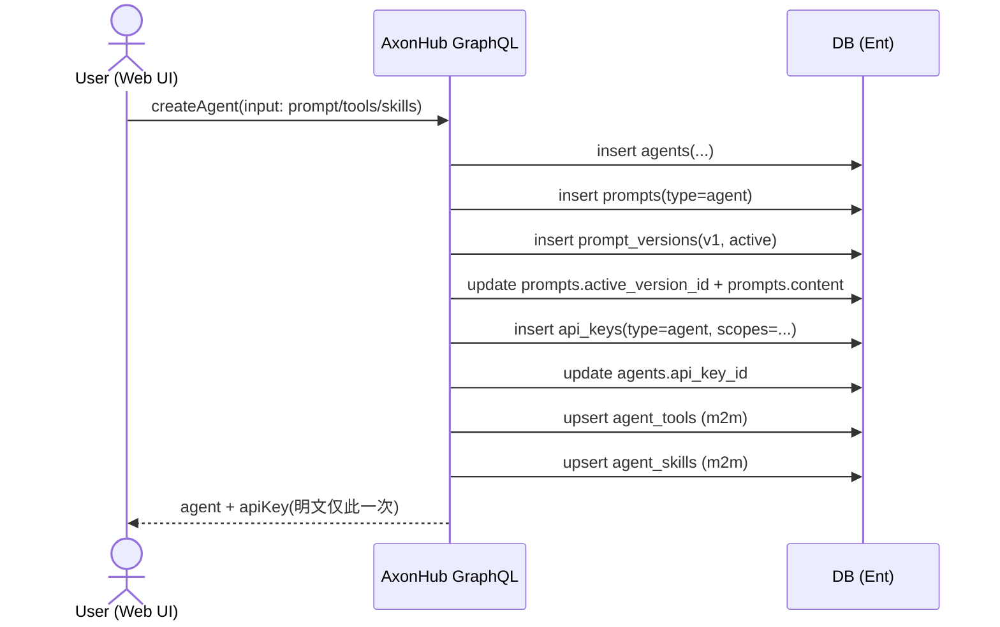
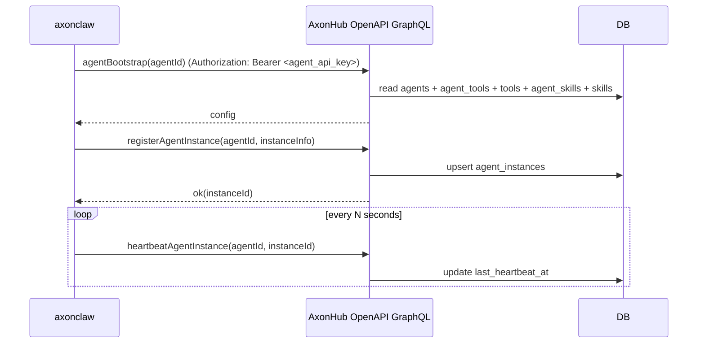
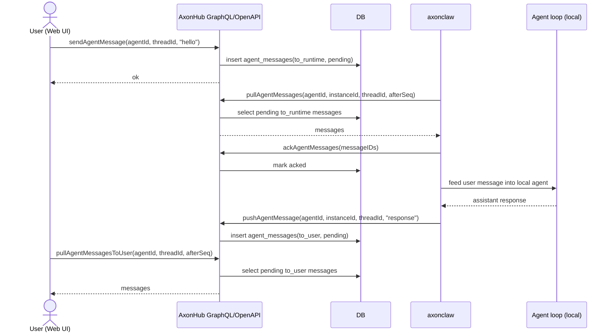
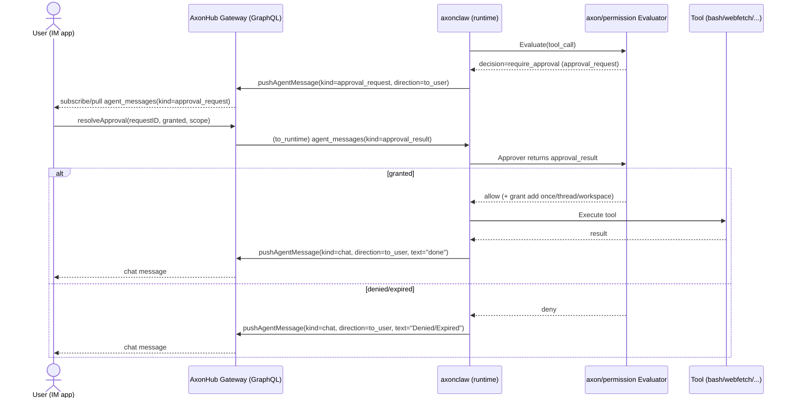

# Agent 框架与投放机制（AxonHub 方案草案）

---

## 目标（你这些零碎想法的“落地形态”）
希望把 AxonHub 从“统一 LLM API 网关”扩展成一个 Agent 控制平面（Control Plane），并用可投放的轻量运行时（Data Plane）去跑 Agent 任务，从而实现：
- 一次配置（provider、鉴权、web search、配额、模型映射等）多处使用：本地/公司/同事/固定服务器/廉价机器。
- 随时扩容：AxonHub 下发任务到更多运行时节点（claw/axon runtime）。
- skills/工具可扩展且可治理：安装、审批、共享、执行策略统一。
- 支持“Claw cluster”：多个运行时一起做一件事（分布式协作）。

本文先基于当前代码现状给出方向与概念边界，作为后续讨论确认与拆解实现的底稿。

## 已确认的决策（收敛版）
1) claw 运行时是独立 runtime，可独立部署，只通过 HTTP API 依赖 AxonHub。  
2) provider 当前只允许连接 AxonHub（不允许 runtime 直连上游）。  
3) skill 允许通过 bash 执行命令，也允许生成脚本后再执行。  
4) sandbox 先做轻量约束，并抽象成 interface，后续可替换实现。  
5) Memory：AxonHub 提供统一存储机制；使用与否由 claw 提示词与工具决定。当前：daily memory 用文件；长期 memory 用 DB（后续 embedding 化）。  
6) 调度/投递先用 HTTP 即可（不强依赖分布式 PubSub）。  

---

## 新需求约束（补充）
- AxonHub 只管理 Agent（定义、权限、配置、关联 API Key）；不管理任务队列，也不需要回传产物。
- 全部交互走 GraphQL，并用代码生成 Go 客户端（参考 [examples/openapi](file:///Users/September_1/Projects/AI/axonhub/examples/openapi/)）。
- 创建 Agent 时：配置 prompt/tools/skills（先不做审批，允许任意安装），并自动创建一个关联的 API Key（给 axonclaw 使用）。
- axonclaw：新增 `cmd/axonclaw`，启动时拉取 Agent 配置并启动后台服务（参考 [cmd/axoncli](file:///Users/September_1/Projects/AI/axonhub/cmd/axoncli/) 的架构习惯）。
- Web 页面可与 Agent 通信（后续可迁移到 IM 软件；AxonHub 作为消息中继/控制面）。

## 现状（代码里已经有的“底座”）
### 1) Agent loop + Tool 注册机制已经存在
现有 `axon/agent.Agent` 已实现典型的 tool-call loop（LLM 调用 -> 执行 tool -> 追加 tool result -> 继续），并支持：
- 最大迭代次数（默认 25）与 system prompt：[agent.go](file:///Users/September_1/Projects/AI/axonhub/axon/agent/agent.go)
- 工具 schema 校验与 registry：[tool.go](file:///Users/September_1/Projects/AI/axonhub/axon/agent/tool.go)
- 事件发布（message/tool lifecycle）到 event bus，便于“外部持久化/追踪”：`agent.event` topic：[agent.go](file:///Users/September_1/Projects/AI/axonhub/axon/agent/agent.go#L142-L176)

同时 `Agent` 的注释里明确了一个重要边界：Agent 实例对应一次会话；如需 thread persistence，应订阅 agent.event 自行持久化消息。[agent.go](file:///Users/September_1/Projects/AI/axonhub/axon/agent/agent.go#L39-L43)

### 2) “Skill” 已经是一个可扩展点（接近 OpenClaw 的技能形态）
`axon/tools/SkillTool` 会从目录加载 skill（workspace 优先，其次 global），并把 skill 内容作为 tool result 返回给模型：[skill.go](file:///Users/September_1/Projects/AI/axonhub/axon/tools/skill.go#L24-L108)

skill 目录的组织形态建议直接采用 Agent Skills 规范（每个 skill 至少包含 `SKILL.md`，其中 YAML frontmatter 里必须有 `name` 与 `description`），从而更利于发现/安装/审批/共享（Skill ≈ 可分发的能力包；真正执行仍靠 tools）。

### 3) Memory 已经被做成 Tools + Store 接口（可选启用）
当前 memory 是 `axon/memory.Store` 接口 + `FileStore`（jsonl 文件）实现，并通过 `MemoryAdd/MemoryGet/MemorySearch` 等工具暴露给 Agent：[memory.go](file:///Users/September_1/Projects/AI/axonhub/axon/tools/memory.go) 与 [file_store.go](file:///Users/September_1/Projects/AI/axonhub/axon/memory/file_store.go)

这与 “memory 只是 tools 而已、可选启用” 的思路一致，只是存储形态与 OpenClaw 的 Markdown memory 不同。

### 4) “集群协作”已经有抽象雏形：EventBus
`axon/bus.EventBus` 定义了 Publish/Subscribe，可替换实现（in-process/Kafka/Redis/NATS 等）：[bus.go](file:///Users/September_1/Projects/AI/axonhub/axon/bus/bus.go)

目前 `Agent.Start()` 会订阅 `agent.request` 并发布 `agent.event`，适合作为“分布式投放/调度”的通信骨架（只差一个分布式 bus 实现或网关）。

---

## 核心概念（建议我们先统一词汇）
### Agent / Run / Thread / Session
- Agent：一次 tool-call loop 的执行器，负责“思考 + 调工具”。
- Thread：可持久化的对话/任务上下文（消息历史、关键状态）。当前代码建议通过订阅 `agent.event` 实现持久化。
- Run：一次触发导致的实际执行（一次用户消息、一次定时触发、一次 webhook 等），Run 可能追加到同一个 Thread。
- Session：运行时层面的“执行上下文”概念（workspace、工具策略、沙箱、临时 token、并发限制等）。可以有，但它更像 runtime 的资源容器，而不是产品层面的 Thread。

### Tool / Skill / Plugin
- Tool：模型可调用的函数（有 schema、有执行结果），对应当前的 `axon/agent.Tool` 接口。
- Skill：可分发的“能力包”，建议遵循 Agent Skills 规范（`<skill>/SKILL.md` + 可选 `scripts/`、`references/`、`assets/`）。它主要提供 prompt/流程模板，真正的副作用由 Tool 完成；当前 `SkillTool` 形态就属于“把 skill 内容交给模型阅读并照着做”。
- Plugin：在工程实现上建议定义为“可替换的 slot”，例如：
  - Provider plugin：模型调用从哪里走（直接上游 vs 走 AxonHub）。
  - Tool plugin：有哪些工具、哪些工具受哪些策略限制。
  - Memory plugin：memory backend（none/jsonl/markdown/db/qmd…）。
  - Sandbox plugin：bash/http/file 等副作用工具如何隔离执行（本机/容器/k8s job…）。

---

## 总体架构方向（Control Plane + Data Plane）
### 1) AxonHub 做 Control Plane（指挥中心）
把 AxonHub 的现有能力（统一 provider、RBAC、API Key、Model Profile、请求/用量记录、Tracing）复用到 Agent 体系中，增加几类控制面对象：
- Agent Definition：Agent 的 system prompt、默认 tools/skills、模型策略（可引用 AxonHub model profile）、触发器（人、cron、webhook）。
- Skill Registry：skill 包上传、版本、审批流、签名、可见范围（个人/团队/公司/公开）。
- Tool Policy：对 tool 的准入控制、参数约束（路径白名单、命令 denylist、超时、网络访问范围等）。
- Runtime Fleet：运行时节点注册、健康检查、能力标签（os/arch、是否支持容器沙箱、可用磁盘、是否允许 bash 等）。
- Shared Memory：可共享记忆的存储与访问控制（团队/项目级），以及同步策略。

### 2) claw/axon runtime 做 Data Plane（可投放运行时）
运行时节点只做三件事：
- 拉配置：从 AxonHub 获取 Agent Definition、skills、tools policy、模型调用配置。
- 跑执行：用 `axon/agent.Agent` 执行 tool-call loop（本地工具 + 可选沙箱）。
- 回传事件：把 `agent.event` 等生命周期事件回传 AxonHub（用于展示/审计/复盘）。

运行时节点本身可以是：
- 本地进程（开发者电脑）
- 常驻服务器（你说的固定服务器）
- k8s/云容器（弹性扩缩）
- “廉价机器”投放（只要能跑 runtime + 连接 AxonHub）

### 3) 模型与 Provider：优先“全都走 AxonHub”
方向建议：runtime 的 Provider plugin 默认只对接 AxonHub（OpenAI/Anthropic 兼容接口），让“一次配置、多次部署”成立：
- 模型选择：复用 AxonHub 的 model profile（映射/正则/路由/负载均衡/失败重试）。
- 配额/计费：复用 AxonHub 的 API Key Profile Quota 与 usage log。
- tracing：复用 AxonHub trace 聚合能力。

运行时无需携带上游 key，安全面更简单：只需要一个“runtime 注册 token”或“agent run token”访问 AxonHub。

---

## Skills 安全与执行（从“能用”到“可治理”）
你提的“准入控制/自动申请/审批/共享/怎么执行”在当前决策下可以这样落地：skill 既可以是“内容包”，也可以包含脚本并通过受控执行路径运行；关键是把风险都收敛到 tool policy + sandbox interface 上。

### 1) Skill：按 Agent Skills 规范组织（SKILL.md + 可选资源）
参考 Agent Skills 规范（https://agentskills.io/specification），skill 是一个目录，最少包含一个 `SKILL.md` 文件：
- 目录名即 skill 名（建议全小写字母/数字/短横线 `-`），并与 `SKILL.md` 的 `name:` 一致。
- `name` 约束：1-64 字符；仅允许小写字母/数字/短横线；不能以 `-` 开头或结尾；不能出现连续 `--`。
- `SKILL.md` 必须包含 YAML frontmatter（`name` + `description` 必填），其后是 Markdown 指令正文（不限格式）。
- 可选目录用于渐进披露（按需加载），避免把所有细节都塞进 `SKILL.md`：
  - `scripts/`：可执行脚本（由受控工具执行，例如 bash + sandbox）。
  - `references/`：更长的参考文档（如 `REFERENCE.md`、模板、表单格式）。
  - `assets/`：模板/数据/图片等静态资源。

目录示例：
```text
my-skill/
├── SKILL.md
├── scripts/
│   └── run.sh
├── references/
│   └── REFERENCE.md
└── assets/
    └── template.json
```

`SKILL.md` 模板示例：
```markdown
---
name: my-skill
description: 说明这个 skill 做什么、什么时候用；包含触发关键词。
license: Apache-2.0
compatibility: 需要 git，且允许运行时访问互联网
metadata:
  author: example-org
  version: "1.0"
allowed-tools: Bash(git:*) Read
---

## 目的
...
```

执行策略建议固定为：runtime 把 skill 安装到 workspace 的受控目录，然后模型通过“受控工具”读取/引用 skill 内容，并在需要副作用时调用受控工具执行 `scripts/` 中的入口；每次执行都落事件与审计记录（至少记录：skill name、版本/metadata、脚本路径与 hash、命令、cwd、stdout/stderr 截断、耗时、退出码）。

### 2) 真正有副作用的是 Tool：必须受策略约束
- bash 类：当前 `axon/tools/Bash` 已有 deny patterns、超时、以及 workspace 路径限制的能力（轻量沙箱）：[bash.go](file:///Users/September_1/Projects/AI/axonhub/axon/tools/bash.go)
- http 类：建议实现“受控 HTTP tool”（只允许访问白名单域名/网段、限制方法与 header、强制超时、禁用本地网段等）。
- 安装脚本：skill 的安装动作也应通过“受控安装器 tool”完成（校验签名/hash、只写 workspace、可回滚、可审计）。

### 3) 审批与共享：放到 AxonHub（Control Plane）
技能治理建议像这样落地：
- 提交 skill（目录/压缩包），至少包含 `SKILL.md`（可选带 `scripts/`、`references/`、`assets/`）
- 自动静态检查（扫描敏感指令、依赖声明、外链等）
- 人工审批（RBAC：谁可以 approve）
- 发布到 registry（可见性：个人/团队/公司）
- runtime 拉取时校验签名与 hash，落盘到 skill dir（workspace 优先覆盖 global 的机制可保留）

---

## Memory：可选插件 + 多层记忆（个人/共享/上传）
你提的 “memory 只是 tools / 可选 / 自己的记忆 / 共享记忆 / 上传记忆” 可以直接映射为三层：

### 1) Daily Memory（文件，runtime workspace）
daily 记忆建议保持“磁盘为真”，落到 runtime workspace 下的文件（便于本地调试、便于导出/同步、也契合 OpenClaw 的直觉）。实现上可以：
- 延续当前 `axon/memory.FileStore`（jsonl）作为 MVP，或直接提供 markdown daily（`memory/YYYY-MM-DD.md`）以便人工阅读。
- 是否写入 daily 由 Agent 的提示词与工具策略决定（可在 Agent Definition 里配置默认开启/关闭）。

### 2) Long-term Memory（DB，AxonHub 统一存储）
长期记忆以 AxonHub DB 为中心：
- runtime 通过 Memory 工具写入时，默认写到 AxonHub（由 runtime 仅连 AxonHub 的决策决定，这一步做起来更统一）。
- 读取/检索也通过 AxonHub API 返回，确保权限一致（RBAC/项目范围）。

### 3) Embedding 化（后续）
后续在 AxonHub 侧为 long-term memory 建立 embedding 索引：
- 存储：DB 为真，embedding/索引是派生物，可重建。
- 检索：先关键词/过滤，再向量召回（或混合检索）。

同时仍建议保留 path 约定（工具描述中已经出现）：`daily/`、`longterm/`、`project/{name}`、`session/{id}`。[memory.go](file:///Users/September_1/Projects/AI/axonhub/axon/tools/memory.go#L32-L55)

---

## 触发与循环（人工/定时/事件驱动）
你写的流程基本可以拆成：
- 初始化：runtime 启动 -> 注册到 AxonHub -> 拉取 agent definition/skills/tools/memory -> 建 workspace。
- 触发：用户消息 / cron / webhook / 队列事件。
- 执行：选择模型（走 AxonHub model profile）-> LLM -> tools -> 事件回传。

在代码层面，“触发”可以先复用 `agent.request` topic（或 HTTP API 入队），运行时只负责消费并执行。

---

## 是否需要 Session？
建议保留，但把它放在“运行时资源容器”的语义上，而不是“对话持久化”的语义上：
- Thread：产品语义（对话/任务上下文），可在 AxonHub 持久化。
- Session：运行时语义（workspace、token、并发、沙箱），可短生命周期，支持一次 Run 或一段时间的任务。

这样既符合当前 `Agent` 的边界（单会话执行器），又能满足你说的“同事、本地、多机器投放”的统一体验。

---

## Claw Cluster：分布式一起做一件事（建议的最小闭环）
建议把“分布式协作”切成两步走：

### 1) 先做 Fleet + 调度（把任务投放出去）
- AxonHub 维护 Runtime 节点列表与能力标签。
- AxonHub 把 Run 投递到某个节点执行（最简单：HTTP 拉取/长轮询；稍后升级到分布式 bus）。
- 节点执行后回传事件与产物。

### 2) 再做 Multi-Agent 协作（把一个任务拆给多个 Agent）
- 协调者 Agent 负责拆分任务图（plan -> tasks）。
- 工作者 Agent 分别在不同节点执行子任务（并行工具调用、各自 workspace）。
- 协调者收敛结果并输出最终产物。

在实现上，`axon/bus` 的接口已经预留了替换空间；当你需要跨机器订阅/发布时，再把 EventBus 换成 Redis Streams/NATS/Kafka 即可。

---

## 新增：在 AxonHub 直接“部署 Agent 到指定机器/目录”（Deploy 方案）
你要的“在 AxonHub 直接操作部署一个 agent 到指定机器，或者目录”，本质是把**运行时部署/编排**纳入 Control Plane：AxonHub 产出部署参数（base URL / API key / workdir），并让 `cmd/axonclaw` 在目标机器上启动并保持在线。

### 目标与边界
- 目标：从 AxonHub UI/接口选择 `Agent + 目标机器 + workspace 目录`，一键达到“正在运行”的 axonclaw 实例；支持停止/重启/更新（滚动更新）。
- 非目标（保持你前面的约束）：AxonHub 不做任务队列，不保证产物回传；只负责 Agent 定义、权限、配置与运行时编排的“期望状态”。

### 两种部署方式（Pull / Push）
#### 方式 A（推荐 / MVP）：Pull（手动下载 + 本机启动）
适用：任何机器（无 SSH/无集中运维条件也能跑通）；先把链路跑通，再考虑自动化。

流程：
1) AxonHub UI：选择 `Agent`，输入 `workdir`（例如 `/data/axon/agents/<agent-id>`），展示“部署信息”（base URL + agent API key）。
2) 在目标机器手动下载 `axonclaw` 可执行文件（例如从 release/内部制品库下载）。
3) 在目标机器启动 axonclaw（示意）：
   - `./axonclaw run --server <baseURL> --api-key <agentApiKey> --workdir <workdir>`
4) axonclaw：用 API key 调用 `agentBootstrap` 拉配置 -> 注册实例并心跳 -> 开始消息中继/执行。

关键点：
- “部署到目录”= axonclaw 的 `--workdir` 参数；AxonHub 只保存/展示期望路径，实际落盘由目标机执行。
- 启动只需要：`base URL + agent API key`（API key 已绑定 agent，因此不需要额外输入 agentID）。

#### 方式 B（增强 / 后续）：Push（通过 SSH 远程下载并部署 axonclaw）
适用：公司内有固定节点/廉价机器池，希望在 AxonHub 里“点一下就跑起来/点一下就停”；当前阶段**不引入 host agent 常驻进程**，直接通过 SSH 完成远程安装/更新/启停。

流程：
1) AxonHub UI：选择 `Agent + 目标机器（ssh user@host:port） + workdir`，点击“远程部署”。
2) AxonHub（或运维机）通过 SSH 在目标机器执行幂等脚本（示意）：
   - 下载/更新 `axonclaw` 二进制到指定路径（如 `/usr/local/bin/axonclaw`）
   - 创建/更新服务（systemd/launchd/supervisor 三选一，按目标 OS）
   - 以 `run --server <baseURL> --api-key <agentApiKey> --workdir <workdir>` 启动/重启
3) axonclaw 启动后向 AxonHub 注册实例并心跳，AxonHub UI 展示部署状态与最近错误。

关键点：
- 不引入 `axonclaw host`：Push 的“自动化”由 SSH 侧完成（远程下载 + 配置服务 + 启停）。
- SSH 凭据处理建议：优先“AxonHub 生成 ssh 命令/脚本由人执行”（避免 AxonHub 保存私钥）；如果必须全自动，再做凭据托管与 RBAC/审计。

### 目录（workdir）策略建议
- 输入形式：`workdir` 支持绝对路径（高级）与相对路径（推荐，相对 `workspaceRoot`）。
- 安全限制：默认只允许 `workdir` 位于 `workspaceRoot` 内；禁止 `..`、软链逃逸；落盘前做 realpath 校验。
- 约定默认路径：`<workspaceRoot>/deployments/<deployment-id>` 或 `<workspaceRoot>/agents/<agent-id>/<deployment-name>`，避免目录冲突。

### Control Plane 数据模型补充（建议新增 Deployment）
为“部署到机器/目录”落地一个最小实体，承载期望状态与运行状态：

#### Deployment（Agent 部署记录 / 期望状态）
字段建议（面向 Ent/GraphQL）：
- `id`（pk）
- `project_id`（fk）
- `agent_id`（fk）
- `runtime_node_id`（fk，可空；模式 A 里可先为空，等实例注册后再关联）
- `name`（可选，便于人类识别）
- `workdir`（string，期望工作目录）
- `desired_state`（enum: RUNNING|STOPPED）
- `pinned_agent_version`（可选：绑定某个 AgentVersion/PromptVersion，支持可控发布）
- `last_reported_state` / `last_error` / `last_heartbeat_at`
- `created_at/updated_at/deleted_at`

### OpenAPI GraphQL（给 axonclaw 用）建议新增/调整
保持“全部交互走 GraphQL”的约束，且尽量复用“拉取式”接口风格：
- 方式 A（Pull）：
  - 不需要额外 token：axonclaw 直接用 `agent APIKey` 调用 `agentBootstrap(agentID)`（或改成 `agentBootstrap: AgentBootstrap!` 由 key 推断 agent），并用既有 `registerAgentInstance/heartbeatAgentInstance` 上线。
- 方式 B（Push + SSH）：
  - 部署动作本身不要求 openapi 新接口；AxonHub 只需要记录 `Deployment` 的目标机信息与期望状态，并在 UI 给出可审计的“远程执行脚本/命令”。
  - （可选）增加 `reportDeploymentStatus(input)`：让 SSH 部署脚本在远端执行完后上报“部署成功/失败 + 错误原因/版本”，便于 UI 展示。

说明：是否继续沿用你现有的 `agent_instances`（每个 Agent 一个实例）取决于“一个节点是否运行多个 agent”。如果要支持 AxonHub 对在线机器部署多个 Agent，建议引入 `RuntimeNode + Deployment` 两层；`AgentInstance` 可以作为“Deployment 的一次运行实例/进程”或逐步被 Deployment 吸收。

### cmd/axonclaw 命令建议（只做方案，不涉及代码改动）
- `axonclaw run --server ... --api-key ... --workdir ...`：Pull 方式的核心入口（只需要 base URL + API key）。
- （可选）`axonclaw deploy ssh ...`：在“运维机/AxonHub”上通过 SSH 在远端下载并部署 axonclaw，然后以 `run ...` 启动（无需 host agent）。

### 权限与安全（最小可用版）
- `agent APIKey` 必须与 project 绑定，且仅具备最小必要权限（读取 `agentBootstrap`、注册/心跳、拉取 skills bundle）。
- `workdir` 只作为期望值/建议值存储；实际落盘受节点本地策略限制。
- 全链路审计：谁发起部署（用户/时间/agent/节点/workdir）、SSH 命令执行记录（至少 hash/摘要）、节点执行结果与错误原因。

---

## 我建议我们先确认的 6 个关键决策（用于收敛方案）
1) 运行时形态：claw/axon runtime 是独立进程/容器，还是嵌入 AxonHub 进程内（我倾向独立，便于隔离与投放）？
2) 模型调用链：runtime 是否一律只打 AxonHub（默认），还是允许“直连上游 provider”（作为高级模式）？
3) Skill 的边界：是否坚持“Skill 只提供文本流程，不执行代码”，把一切副作用下沉到 Tool？
4) Sandbox 的目标级别：先走“轻量（路径限制 + denylist + timeout）”，还是第一版就做“容器级隔离”？
5) Memory 的事实来源：更偏 OpenClaw（Markdown 文件为真），还是更偏平台化（AxonHub DB 为真）？
6) 分布式通信：第一版用 HTTP 拉取任务（最简单），还是直接上 Redis/NATS 做 bus？

以上 6 点已确认，下一步进入“对象模型 + HTTP API 草图 + MVP 里程碑”。

---

## 对象模型（建议的最小集合）
### Control Plane（AxonHub）
- RuntimeNode：运行时节点（注册信息、能力标签、最后心跳、版本）。
- AgentDefinition / AgentVersion：Agent 定义（prompt、默认 tools/skills、是否启用 daily memory、并发策略、超时等）与版本化发布。
- Thread：对话上下文容器（用于 UI 通信与连续对话，不作为任务队列）。
- SkillBundle / SkillVersion：技能包（含 manifest、prompt、scripts、签名/hash、审批状态、可见范围）。
- ToolPolicy：工具准入与约束（bash denylist、workspace 限制、http allowlist、memory 是否可用等）。
- MemoryEntry：长期记忆（DB 存储，支持权限、标签、来源、后续 embedding）。
- Event：运行事件流（复用 `agent.event` 的语义：message/tool lifecycle + 自定义事件）。

### Data Plane（claw runtime）
- Workspace：每个 Run 的工作目录（承载 daily file、skill 安装目录、产物）。
- Sandbox：执行隔离（interface 抽象，当前可先用轻量实现）。

---


## MVP 里程碑（按你的决策倒推）
### MVP-1：Agent 管理 + axonclaw bootstrap + Web 通信
- Web UI 创建 Agent（prompt/tools/skills）并自动创建绑定的 service_account APIKey（一次性返回明文）。
- Web UI 创建 Agent（prompt/tools/skills）并自动创建绑定的 agent APIKey（一次性返回明文）。
- axonclaw 启动：用 agent APIKey 调用 `agentBootstrap` 拉配置并启动后台服务。
- Web UI 与 axonclaw 通过 GraphQL 做消息中继（pull + ack），AxonHub 不做任务调度与产物管理。
 
### MVP-2：任意安装 skills + 脚本执行（受控 bash）
- 允许用户为 Agent 配置 skills（先不审批）。
- axonclaw 安装 skill 到 workspace 目录，并通过受控 bash/sandbox interface 执行脚本（全程可审计）。

### MVP-2：Skill registry + 审批 + 脚本执行闭环
- SkillBundle 版本化与审批流。
- runtime 安装 bundle（校验签名/hash）到 workspace，并通过受控 bash/sandbox 执行脚本。
- tool policy 先轻量（denylist/路径限制/超时），但保留 interface 替换点。

### MVP-3：Memory 双层（daily 文件 + long-term DB）
- daily：workspace 文件（可 jsonl 或 markdown）。
- long-term：AxonHub DB，Memory tools 默认读写 DB。

### MVP-4：Embedding memory（可选后续）
- AxonHub 侧建立向量索引，提供混合检索 API，权限与审计不变。

## 任务列表（落地拆解）
> 目标：把“里程碑描述”拆成可执行的工程任务，便于排期与分工。

### MVP-1：Agent 管理 + axonclaw bootstrap + Web 通信
- [x] 落地 Ent Schema：agents / tools / skills / agent_tools / agent_skills / agent_instances / agent_threads / agent_messages / agent_memories / prompt_versions
- [x] 扩展 prompts：增加 `type/active_version_id/draft_version_id`（其中 `type` 枚举：`agent/system`）
- [x] 实现主站 GraphQL：createAgent/updateAgent/deleteAgent（自动创建 `prompts(type=agent)`、自动创建并绑定 agent APIKey；支持 builtinTools + skillsPolicy 等字段）
- [ ] 实现 prompt_versions 的 draft->publish->active 流转，并在 createAgent 中写入版本记录（如需要）
- [x] 实现 Agent API GraphQL（`/agent/v1/graphql`）：agentBootstrap（下发 systemPrompt/model/tools/skills/builtinTools/skillsPolicy）
- [x] 实现 runtime 在线协议：registerAgentInstance + heartbeatAgentInstance
- [x] 实现消息中继协议：send/push/pull(to_runtime)/pullToUser(to_user)/ack（sequence 递增、pending/acked/expired 状态）
- [x] 完成 Agent API 鉴权与权限边界：仅允许 `type=agent` 的 APIKey；且必须归属 agent 并在 project 范围内
- [x] 新增 cmd/axonclaw：bootstrap 拉配置、注册实例+心跳、轮询 pull+ack、驱动本地 agent loop、push 回传
- [x] Web UI：Agent 列表/创建/编辑/删除（支持 builtinTools + skillsPolicy 等字段；创建后一次性展示 APIKey 明文）
- [x] Web UI：Agent 详情 + thread 对话页（send + pullToUser）+ 实例在线状态展示
- [ ] 增加测试：createAgent/agentBootstrap/消息 pull+ack/鉴权边界 + 最小端到端联调回归

### MVP-2：任意安装 skills + 脚本执行（受控 bash）
- [ ] 定义并实现 runtime 的 skill 安装目录约定（workspace 受控目录；workspace 覆盖 global 的优先级可保留）
- [ ] 落地 skill 执行审计：skill 元数据、脚本路径/hash、命令、cwd、stdout/stderr 截断、退出码、耗时
- [ ] 完成 tool policy MVP：bash denylist/超时/workspace 路径限制；并保留 sandbox interface 可替换点
- [ ] 落地 “受控安装器” 工具：校验 hash/签名（v1 可先 hash）、只写 workspace、支持回滚、可审计
- [ ] 贯通 AgentDefinition 的 builtinTools/config 与 skillsPolicy：后端存储 JSON 与 GraphQL 结构化输入输出互转；runtime 按 policy 执行

### MVP-2（升级）：Skill Registry + 审批 + 脚本执行闭环
- [ ] 增强 skills registry：bundle 元数据（文件清单/hash/下载信息/签名）、版本、审批状态、可见性范围
- [ ] runtime 安装 bundle：下载/解包、校验签名/hash、落盘 workspace、按入口脚本执行（仍受 tool policy 约束）

### MVP-3：Memory 双层（daily 文件 + long-term DB）
- [ ] daily memory：选择 jsonl（复用 FileStore）或 markdown（YYYY-MM-DD.md）并落到 workspace
- [ ] long-term memory：AxonHub DB 作为事实源；Memory tools 默认读写 DB；支持 path 约定与 RBAC
- [ ] 记忆读写审计与检索：按 project/agent/path 过滤；为后续 embedding 预留字段/索引

### MVP-4：Embedding memory（可选后续）
- [ ] 建立向量索引（派生物可重建），提供混合检索 API（关键词过滤 + 向量召回）
- [ ] 保持权限与审计一致：检索结果与读写同一套 RBAC/可见性策略

---

## 具体实体与表设计（面向 Ent/GraphQL 落地）
下面按“你最新约束”给出具体表设计；其中 APIKey/Project/User/Thread 可复用现有实体：
- APIKey：现有 [api_key.go](file:///Users/September_1/Projects/AI/axonhub/internal/ent/schema/api_key.go)
- Project：现有 [project.go](file:///Users/September_1/Projects/AI/axonhub/internal/ent/schema/project.go)
- Thread：现有 [thread.go](file:///Users/September_1/Projects/AI/axonhub/internal/ent/schema/thread.go)
- Prompt：现有 [prompt.go](file:///Users/September_1/Projects/AI/axonhub/internal/ent/schema/prompt.go)

### 1) agents（Agent 定义）
用途：AxonHub 管理 Agent 的 prompt/tools/skills 配置，并绑定一个 service_account API key 给 axonclaw 使用。

字段建议：
- `id` (int, pk)
- `project_id` (int, immutable, fk -> projects.id)
- `created_by_user_id` (int, immutable, fk -> users.id)
- `name` (string)
- `description` (string, default "")
- `status` (enum: enabled|disabled|archived, default enabled)
- `prompt_id` (int, immutable, fk -> prompts.id)：Agent 的 system prompt 入口（prompt 本身支持版本）
- `model` (string, default "")：允许为空（表示走 profile/默认模型）
- `agent_builtin_tools` (json, default `[]`)：配置开启哪些 built-in tools（名单固定，来源 `axon/tools/*`；GraphQL 使用结构化 `builtinTools` 输入/输出）
- `skills_policy` (json, default `{"add":"open"}`)：skill 安装/新增策略（GraphQL 使用结构化 `skillsPolicy` 输入/输出）
- `api_key_id` (int, immutable, fk -> api_keys.id, unique)：自动创建并绑定的 agent key
- `created_at/updated_at/deleted_at`（TimeMixin + SoftDeleteMixin）

索引建议：
- `(project_id, deleted_at)` 用于列表
- `(project_id, name, deleted_at)` unique（同项目下同名）
- `(api_key_id)` unique（一个 agent 对应一个 key）

关系建议：
- Agent <-> Tool：通过 `agent_tools` 做 m2m（仅用于 custom tools：需要客户端自己实现的 tool）
- Agent <-> Skill：通过 `agent_skills` 做 m2m（用于启用/禁用、排序、以及每个 skill 的参数/入口选择）
- Agent -> Prompt：通过 `prompt_id` 关联到 prompts（prompt 版本演进不影响 agent 表结构）

`agent_builtin_tools` 结构建议（v1）：
- 数组，元素形如：`{name, enabled, order, config}`
- `name`：内置工具名，固定来自 `axon/tools/*`（排除 `common.go`），例如 `bash/edit/glob/grep/memory/read/skill/write`
- `enabled`：默认 true；`order`：默认 0；`config`：可选 JSON（覆盖/补充该 tool 的默认策略）

`skills_policy` 约定（v1）：
- `add` (enum)
  - `open`：自由安装/新增 skill（默认）
  - `approval_required`：新增 skill 需要审批（由 AxonHub/管理端流程决定；客户端仅消费结果）
  - `registry_only`：只能安装已在 `skills` 注册表存在的 skill

### 0) prompts（增加类型 + 支持版本入口）
用途：复用现有 prompts 作为“提示词资产”的稳定标识，并增加类型以区分用途（其中一种用途就是 agent 的 system prompt）。

对现有 prompts 增量字段建议：
- `type` (enum)：`agent` / `system`
- `active_version_id` (int, nullable, fk -> prompt_versions.id)：当前生效版本（用于运行时读取）
- `draft_version_id` (int, nullable, fk -> prompt_versions.id)：当前草稿版本（用于编辑）

兼容建议：
- 现有 `prompts.content` 保留作为“当前 active 内容”的冗余字段；发布时将 active version 的 content 复制到 `prompts.content`，并更新 `active_version_id`，以便平滑迁移前端/查询路径。

### 0.1) prompt_versions（Prompt 版本）
用途：为 prompt 的修改、评估、发布流程做准备；agent 不需要版本化，但 prompt 需要。

字段建议：
- `id` (int, pk)
- `project_id` (int, immutable)
- `prompt_id` (int, immutable, fk -> prompts.id)
- `version` (int)：从 1 开始递增（或用 `created_at` 排序也可，但 version 更直观）
- `content` (text)
- `status` (enum: draft|active|archived, default draft)
- `change_log` (string, default "")
- `created_by_user_id` (int, nullable)
- `created_at/updated_at/deleted_at`

索引建议：
- `(prompt_id, version, deleted_at)` unique
- `(prompt_id, status, deleted_at, created_at)`

编辑/发布规则（按你定义的流程）：
1) 编辑：
   - 若 `prompts.draft_version_id` 存在：直接编辑该 draft version 的 `content`。
   - 若 `prompts.draft_version_id` 不存在：新建一个 `prompt_versions(status=draft)`，写入 `prompts.draft_version_id`，然后编辑该 draft 的 `content`。
2) 发布（publish draft -> active）：
   - 将 draft version 的 `status` 置为 `active`。
   - 将原 `active_version_id` 指向的版本（如果存在）置为 `archived`。
   - `prompts.active_version_id = draft_version_id`，并清空 `prompts.draft_version_id`。
   - 将 active version 的 `content` 复制到 `prompts.content`（保持“prompt 表上有当前生效内容”的快速读取与兼容）。

### 1.1) tools（Tool Registry）
用途：custom tool 注册表（定义“有哪些 tool”、它们的 schema、默认策略与版本信息）。custom tool 表示“需要客户端自己实现”的 tool；AxonHub 只负责注册与下发配置。

字段建议：
- `id` (int, pk)
- `project_id` (int, immutable, fk -> projects.id, nullable)：为空表示 system/global tool；不为空表示项目内自定义 tool
- `name` (string)：例如 `bash` / `http` / `memory_add` / `memory_search`
- `description` (string, default "")
- `type` (enum: custom, default custom)
- `schema` (json)：tool 参数的 JSON schema（或引用生成规则）
- `default_policy` (json)：默认策略（例如 bash denylist/workspace 限制/http allowlist）
- `status` (enum: enabled|disabled|archived, default enabled)
- `created_by_user_id` (int, nullable)
- `created_at/updated_at/deleted_at`

索引建议：
- `(project_id, name, deleted_at)` unique（同项目或全局范围下的唯一）

### 1.2) skills（Skill Registry）
用途：全局技能注册表（定义“有哪些 skill”、内容与脚本元数据）。当前可“任意安装”，即任何项目成员可创建 skill；后续再加审批字段与流程。

字段建议：
- `id` (int, pk)
- `project_id` (int, immutable, fk -> projects.id, nullable)：为空表示 global；不为空表示项目级
- `name` (string)
- `description` (string, default "")
- `kind` (enum: prompt|script|hybrid, default prompt)
- `content` (text)：prompt 或说明文档（可选）
- `entrypoint` (string, default "")：脚本入口（可选，例如 `scripts/run.sh`）
- `bundle` (json, nullable)：可选，存放脚本文件列表/hash/下载地址/签名信息（v1 可先不用）
- `status` (enum: enabled|disabled|archived, default enabled)
- `created_by_user_id` (int, nullable)
- `created_at/updated_at/deleted_at`

索引建议：
- `(project_id, name, deleted_at)` unique

### 1.3) agent_tools（Agent 与 Tool 的 m2m）
用途：为某个 Agent 启用某些 tool，并提供 agent 级配置与排序。

字段建议：
- `id` (int, pk)
- `project_id` (int, immutable)
- `agent_id` (int, immutable, fk -> agents.id)
- `tool_id` (int, immutable, fk -> tools.id)
- `enabled` (bool, default true)
- `order` (int, default 0)
- `config` (json, default {})：覆盖/补充 tool 默认策略（例如特定 agent 的 http allowlist）
- `created_at/updated_at`

索引建议：
- `(agent_id, tool_id)` unique
- `(agent_id, enabled, order)`

### 1.4) agent_skills（Agent 与 Skill 的 m2m）
用途：为某个 Agent 启用某些 skills，并提供参数与排序。

字段建议：
- `id` (int, pk)
- `project_id` (int, immutable)
- `agent_id` (int, immutable, fk -> agents.id)
- `skill_id` (int, immutable, fk -> skills.id)
- `enabled` (bool, default true)
- `order` (int, default 0)
- `args` (string, default "")：给 skill 的默认参数（v1 可选）
- `created_at/updated_at`

索引建议：
- `(agent_id, skill_id)` unique
- `(agent_id, enabled, order)`

### 2) agent_instances（axonclaw 实例注册）
用途：一个 Agent 可能在多台机器上跑多个 axonclaw 实例；AxonHub 不调度任务，但需要知道“哪个实例在线”，用于消息中继与可观测。

字段建议：
- `id` (int, pk)
- `project_id` (int, immutable)
- `agent_id` (int, immutable, fk -> agents.id)
- `instance_id` (string/uuid, immutable)：axonclaw 本地生成
- `name` (string, default "")
- `platform` (string)：os/arch
- `version` (string)：axonclaw 版本
- `last_heartbeat_at` (datetime)
- `created_at/updated_at/deleted_at`

索引建议：
- `(agent_id, last_heartbeat_at)`
- `(agent_id, instance_id, deleted_at)` unique

### 3) agent_threads（Agent 与 Thread 绑定）
用途：复用现有 `threads` 表（project_id + thread_id），再用 join 表把 thread 归属到某个 agent。

字段建议：
- `id` (int, pk)
- `project_id` (int, immutable)
- `agent_id` (int, immutable, fk -> agents.id)
- `thread_row_id` (int, immutable, fk -> threads.id)
- `created_at/updated_at`

索引建议：
- `(agent_id, thread_row_id)` unique

### 4) agent_messages（UI <-> axonclaw 消息中继，不是任务队列）
用途：AxonHub 作为中继层，让 Web UI 与 runtime 通信；不做任务管理，只做消息存储与投递确认（可加 TTL）。

字段建议：
- `id` (int, pk)
- `project_id` (int, immutable)
- `agent_id` (int, immutable)
- `thread_row_id` (int, immutable, fk -> threads.id)
- `direction` (enum: to_runtime|to_user)
- `sender_type` (enum: user|runtime|system)
- `sender_id` (int, nullable)：user_id 或 agent_instances.id
- `kind` (enum: chat|approval_request|approval_result|system_event)
- `correlation_id` (string, default "")：用于跨消息关联（例如 `approval_request.id`）
- `text` (text, nullable)：`kind=chat` 时使用
- `payload` (json, nullable)：结构化数据（例如 approval request/response；或 chat metadata）
- `status` (enum: pending|acked|expired)
- `sequence` (bigint)：同一 thread 内递增，便于增量拉取
- `expires_at` (datetime, nullable)
- `created_at/updated_at/deleted_at`

索引建议：
- `(agent_id, thread_row_id, sequence, deleted_at)` unique
- `(agent_id, status, deleted_at, created_at)` 用于拉取 pending
- `(agent_id, correlation_id, deleted_at)`：用于幂等与关联（例如 `approval_request`/`approval_result`）

### 5) agent_memories（记忆存储，AxonHub 仅提供存储）
用途：AxonHub 只提供记忆的通用存储能力，不感知“长期/短期”；由 agent 自己控制写入策略与读取策略。

字段建议：
- `id` (int, pk)
- `project_id` (int, immutable)
- `agent_id` (int, nullable, fk -> agents.id)
- `path` (string)
- `content` (text)
- `source` (string, default "")
- `created_at/updated_at/deleted_at`

索引建议：
- `(project_id, agent_id, deleted_at, created_at)`
- `(project_id, path)`

---

## 流程图
### 1) 创建 Agent（Web UI）


### 2) axonclaw 启动与在线（拉配置 + 心跳）


### 3) Web 页面与 Agent 通信（消息中继）


---

## 方案补充：参考 OpenClaw/PicoClaw 的 Channels + Gateway 设计，让 IM app 可与 axonclaw 交互

本节只讨论“通信通道（channel）如何接入网关（gateway）并与运行时交互”的方案；不涉及其他业务代码与实现细节。

### 1) OpenClaw 的关键做法（可直接借鉴的交互模型）

OpenClaw 把 **Gateway** 设计成一个“单一入口”的 WebSocket 服务（同时也是控制平面与节点传输层）：

- **一切客户端都连同一个 Gateway WS**：CLI / WebChat UI / macOS app / iOS&Android node / headless node。
- **统一握手 + 声明角色**：连接的第一帧必须是 `connect`，并声明 `role` 与能力（OpenClaw 将角色分为 `operator` 与 `node`）。
- **RPC + 事件流**：WS 文本帧承载 JSON，按 `{req,res,event}` 三类 frame 做请求响应与异步事件广播。
- **确定性路由与会话隔离**：按 channel/peer/thread 构造 session key，并把“回复回到哪个 channel”视为宿主配置决定（模型不选 channel）。

这套模型的价值在于：把“外部聊天通道”“控制 UI”“本地/远程节点能力（camera/screen/exec approval）”都统一成同一种 Gateway 连接与 RPC 语义，降低集成表面积。

### 2) PicoClaw 的关键做法（轻量版的 channel 运行方式）

PicoClaw 没有做“对外统一的 Gateway WS 协议”，而是用进程内 MessageBus 把 channel 与 agent loop 解耦：

- **Channel 只负责收/发**：每个 channel 实现把入站消息归一化后发布到 bus；出站消息从 bus 订阅再发回对应平台。
- **会话键是可复用的约定**：PicoClaw 有明确的 session key 构造规则（按 agent/channel/peerKind/peerId 组合，DM scope 可调）。
- **有些 channel 本身通过 WS 对接外部**：例如 OneBot / WhatsApp bridge / QQ 等，但这是“某个 channel 的实现细节”，不是对外统一的网关协议。

这套模型的价值在于：如果你不想一开始就设计完整的 Gateway WS 协议，仍然可以用“统一消息模型 + session key”把 channel 接入跑起来。

---

## 推荐方案：AxonHub 作为 Gateway（Control Plane），IM app 作为 Channel Surface，axonclaw 作为 Runtime（Data Plane）

目标：让 **IM app ↔ axonclaw** 可以双向对话，同时保持既有约束（“交互走 GraphQL”，“AxonHub 不做任务队列”）。

### A) 角色与连接形态（对齐 OpenClaw 的 operator/node 语义）

- **IM app**：作为 `operator`（人机交互端）。它不直连上游模型与工具，只负责“发消息/收消息/展示状态”。
- **axonclaw**：作为 `node/runtime`（执行端）。它运行本地 agent loop 与 tools，并通过 AxonHub 获取配置与回传输出。
- **AxonHub**：作为 `gateway`（中继与鉴权点）。它承载：
  - 运行时 bootstrap（agent 配置下发）
  - instance presence（在线/心跳）
  - 消息中继（to_runtime / to_user 的双向队列，但不承担调度/排队语义）

### B) “Channel” 在 AxonHub 侧的定义（把 IM app 当作一种 channel）

为了把 IM app、Web UI、未来的 Telegram/Slack 等统一起来，建议在消息模型里显式携带 channel 维度：

- `channel`: 消息来自/发往的表面（例如：`webui`、`imapp`、未来可扩展 `telegram`/`slack` 等）
- `peer`: 对端标识（至少要有 `kind` + `id`）
- `thread`: 业务线程（IM app 的会话/群/频道/话题 thread），用于隔离上下文与 UI 展示

对应到“会话键（session key）”，直接复用 OpenClaw/PicoClaw 的思路，统一成可组合的字符串约定（示例）：

- DM（按配置决定是否折叠到 main）：`agent:<agentId>:<channel>:direct:<peerId>`
- 群/频道：`agent:<agentId>:<channel>:group:<peerId>` / `agent:<agentId>:<channel>:channel:<peerId>`
- thread：在 base key 后追加 `:thread:<threadId>`（如果 IM app 原生支持 thread）

这样 AxonHub 不需要理解每个 IM 平台的复杂语义，只需要保存与透传“路由维度”，并把它映射到 thread/session 的隔离策略即可。

### C) 传输层选择（保持 GraphQL 为主，同时提供实时能力）

保持 “全部交互走 GraphQL” 的前提下，建议把“网关交互”分成两类通道：

1) **axonclaw ↔ AxonHub：HTTP GraphQL（pull+ack）**  
   - 继续沿用本文现有的 `pullAgentMessages` / `ackAgentMessages` / `pushAgentMessage`。
   - 优点：简单、稳健、对常驻后台服务友好；断线重连容易（靠 afterSequence/limit）。

2) **IM app ↔ AxonHub：GraphQL（Query/Mutation + Subscription over WebSocket）**  
   - 发送：Mutation（例如 `sendAgentMessage`）。
   - 接收：优先用 Subscription 做实时（例如订阅某个 `threadID` 的 to_user 消息流）；不支持 Subscription 的客户端退化为 `pullAgentMessagesToUser` 轮询。
   - 这样 IM app 获得“类 Gateway WS”的体验，但仍然是 GraphQL 语义，不需要另起一套自定义 WS 协议。

### D) 端到端交互流程（IM app 与 axonclaw 双向对话）

以“IM app 发消息 → axonclaw 处理 → IM app 收回复”为例，推荐的最小链路：

1. IM app 调用 AxonHub（管理端 GraphQL）创建/选择 thread，并 `sendAgentMessage(agentId, threadId, text, channel="imapp", peer=...)`。
2. AxonHub 写入一条 `agent_messages(direction=to_runtime, status=pending, channel, peer, threadId, sequence)`。
3. axonclaw 通过 OpenAPI GraphQL `pullAgentMessages` 拉取 pending（按 agentId/instanceId/threadId/afterSequence）。
4. axonclaw **基于 channel+peer(+thread) 构造 session key**，把消息喂给本地 agent loop。
5. agent loop 输出 assistant response，axonclaw `pushAgentMessage(direction=to_user, channel="imapp", peer=..., threadId, text)` 回传 AxonHub。
6. IM app 通过 Subscription 实时收到（或轮询 `pullAgentMessagesToUser` 收到），并展示到对应会话。

> 关键点：channel/peer/thread 只用于“路由与隔离”，AxonHub 仍然只是中继；真正的执行与上下文在 axonclaw。

### E) 鉴权与安全（对齐 OpenClaw 的“网关统一鉴权点”思想）

- **axonclaw → AxonHub**：继续使用 `agent APIKey`（本文已定义），并且：
  - 由 key 绑定 agentId（避免“拿着 key 操作别的 agent”）。
  - instance 注册 + 心跳用于 presence 与审计。
- **IM app → AxonHub**：使用用户登录态（JWT/RBAC）控制：
  - 哪些用户/群/组织可以访问某个 agent/thread。
  - 哪些 thread 可以向某个 agent 写入消息（避免跨项目/跨 agent 注入）。

如果未来 IM app 需要“设备级配对/最小权限 token”（类似 OpenClaw device token），建议在 AxonHub 增加一个“IM 设备 token”概念，但 v1 不强制。

---

## 备选方案：把 IM app 适配器做成 axonclaw 的 Channel（PicoClaw 风格）

当 IM app 无法轻易作为 GraphQL 客户端接入，或你希望 IM app 走其原生 webhook/WS API 时，可以改为：

- 在 axonclaw 侧实现 `imapp` channel adapter：
  - 入站：把 webhook/WS 事件归一化成 `InboundMessage(channel="imapp", senderID, chatID/threadID, content, metadata)` 并投递给 agent loop。
  - 出站：从 agent 输出构造 `OutboundMessage` 调用 IM 平台 API 发回。
- AxonHub 仍然只负责 agent 配置下发与模型网关；IM app 的“通道连接状态”归 axonclaw 管。

优点：对 IM 平台能力利用更直接（群管理、@mention、thread、reaction 等）；缺点：IM app 与 axonclaw 耦合更强，部署时需要 channel adapter 的额外运维。

---

## 方案补充：结合 `axon/permission` 在 IM 场景实现审批（Human-in-the-loop）

`axon/permission` 的本质是在 **tool 真正执行前** 做一次统一的 AuthZ/审批管线：资源抽取 → hard deny → grant 命中 → policy 评估 →（必要时）向 UI 发起审批并阻塞等待。

IM 场景下，审批 UI 不再是本地 TUI，而是 **IM app 里的交互卡片/消息**（或 Web UI 的审批面板）。因此关键是：把 `approval.Service` 从“进程内订阅者”替换成“通过 AxonHub 网关转发的远程审批”。

### 1) 角色分工（谁负责做什么）

- **axonclaw（runtime）**：继续运行 `permission.Evaluator`，并在需要审批时发起 `approval.Request`；拿到批准结果后写入 grant（once/thread/workspace），然后继续执行工具或拒绝。
- **AxonHub（gateway/control plane）**：承载审批请求的落库/路由/鉴权，负责把审批请求分发给可操作的 operator（IM app/Web UI），并把 operator 的决议可靠地回传给对应的 axonclaw 实例。
- **IM app（operator surface）**：展示审批请求（摘要/风险/资源），并让用户选择：`Allow once` / `Allow thread` / `Allow workspace` / `Deny`。

### 2) 审批请求需要携带的最小信息（直接复用 `approval.Request` 字段）

IM 里展示与决策必须是“人能看懂且可审计”的，字段建议与 `axon/permission/approval.Request` 对齐：

- `request_id`：审批请求唯一 ID（用于幂等与回传）
- `agent_id` + `thread_id`：定位到具体会话（决定 thread scope 的语义）
- `instance_id`：定位到具体运行时实例（用于把决议发回正确的等待者）
- `tool_call_id` + `tool_name`
- `capabilities[]`：如 `fs.read` / `proc.exec` / `net.fetch`
- `risk_level`：`low|medium|high|critical`
- `summary` + `reason`
- `resources`（已脱敏、JSON-safe）：路径（workspace 相对路径优先）、domain/scheme、command 摘要（首 token 或安全摘要）

> 重要：`resources` 必须是“抽取后的归一化资源”，而不是原始 tool input；避免把敏感 token/全文 URL query/命令参数直接抛到 IM。

### 3) 传输与交互：沿用“消息中继（pull+ack）”，但新增“审批消息类型”

为了保持“全部交互走 GraphQL”，建议把审批也纳入本文已有的消息中继链路，但需要区分普通对话与审批控制面消息：

- `agent_messages` 增加 `kind`（示例：`chat|approval_request|approval_result|system_event`）以及可选 `payload: JSON`（承载 `approval.Request` / `approval.Response`）。
- IM app 收到 `approval_request` 时渲染为“审批卡片”，带 4 个动作按钮（once/thread/workspace/deny）。
- IM app 点击后调用 AxonHub 的 `resolveApproval(input: { agentID, threadID, requestID, granted, scope, reason })`（管理端 GraphQL，受 RBAC 保护；其中 `requestID` 对应 `approval_request.id`）。
- AxonHub 把决议写库并向运行时侧投递一条 `approval_result`（direction=to_runtime，payload 含 granted/scope）。
- axonclaw 的远程 `Approver.Request(...)` 阻塞等待 `approval_result`（通过 `pullAgentMessages` 拉取并匹配 `request_id`），收到后返回 `approval.Response` 给 `permission.Evaluator`。

这能保证：IM app 不需要理解工具执行细节，只需要处理一个可审计的“批准/拒绝”动作；axonclaw 也不需要暴露任何公网回调，只要能主动 pull AxonHub。

### 3.1) v1：approval 消息 payload 约定（可直接落地的最小协议）

`kind=approval_request`（direction=to_user, sender_type=system）：

```json
{
  "id": "apr_01J... (uuid)",
  "agent_id": "A1",
  "thread_id": "T1",
  "instance_id": "I1",
  "tool_call_id": "call_...",
  "tool_name": "bash",
  "capabilities": ["proc.exec"],
  "risk_level": "high",
  "summary": "bash (require_approval)",
  "reason": "approval required by default",
  "resources": [
    { "type": "command", "command": "git status", "cwd": "/work" }
  ],
  "expires_at": "2026-02-22T10:00:00Z"
}
```

`kind=approval_result`（direction=to_runtime, sender_type=user）：

```json
{
  "request_id": "apr_01J...",
  "granted": true,
  "scope": "once",
  "reason": "ok"
}
```

约束（v1）：
- `approval_request.id` 作为 `correlation_id`，用于幂等与匹配结果。
- `approval_request.expires_at` 过期后，即使 operator 再批准也应拒绝（axonclaw 侧按超时/过期拒绝）。
- `resources` 必须是 `axon/permission` 抽取/脱敏后的资源数组（不要透传原始 tool input）。
- `approval_result.request_id` 建议与 GraphQL 入参的 `requestID` 做一一映射（只是命名风格不同）。

### 4) Grant scope 在 IM 场景的语义（once/thread/workspace）

IM 交互需要把 scope 的含义说清楚，否则用户无法做出安全选择。建议在卡片里直接解释：

- `once`：仅本次 tool_call 放行（最安全，默认推荐）
- `thread`：对当前 `thread_id` 里的后续同类操作放行（会话级便利，但要提示风险）
- `workspace`：对当前运行时实例的 workspace 放行（机器/工作目录级；适合长期可信环境）

注意点（方案层面建议）：

- `thread` scope 的 key 应与 `permission/grant.BuildKey` 一致（capability + tool_name + 归一化资源），并绑定 `thread_id`。
- `workspace` scope 默认是“本机生效”（落在 axonclaw 本地 grant store）；如需跨多实例/多机器共享，需要把 workspace scope 的 grant 迁移到 AxonHub 存储并按 agent_id + workspace_id 复用（后续增强项）。

### 5) 默认安全与降级策略（IM 不在线时怎么办）

`axon/permission` 当前在“无 UI 订阅者”时会报错（`approval requested but no UI subscribers are available`）。映射到 IM 场景，建议定义清晰的行为：

- 若需要审批但 **IM app/Web UI 不在线**：默认拒绝（或超时拒绝），并向用户侧留下“需要审批但无人可批”的 system message。
- 对 `RiskCritical` 可以要求二次确认（例如“输入确认短语”或“再次点击确认”），避免 IM 误触。
- Hard deny 规则（危险命令模式、敏感路径、非 http(s) scheme）永远不走审批，直接拒绝，并在 IM 中回显 `rule_id` 与简短原因。

### 6) 权限边界（AxonHub RBAC × axon permission 的职责划分）

需要强调两层权限互补而不是替代：

- **AxonHub RBAC（谁能对 agent/thread 操作）**：决定“谁能发消息、谁能审批、谁能改策略/看审计”。
- **axon/permission（工具能不能在本机执行）**：决定“这个 tool_call 是否允许执行，以及需要什么级别的人工确认”。

也就是说：即使用户在 AxonHub 有权限聊天，也不代表可以无审批执行高风险工具；反之亦然。

### 7) v1：IM 审批时序图（从 tool_call 到批准/拒绝）



## GraphQL 协议草图（v1）
端点划分建议：
- 管理端（Web UI，用户登录）：主站 GraphQL（现有 `axonhub.graphql` 体系）。
- runtime 端（axonclaw，APIKey 认证）：扩展 `/openapi/v1/graphql`（现有 [openapi.graphql](file:///Users/September_1/Projects/AI/axonhub/internal/server/gql/openapi/openapi.graphql)）。

### 主站 GraphQL（Web UI）需要的 Query/Mutation（草图）
说明：
- 主站 GraphQL 的 `type Query` 定义来自 Ent 生成的 [ent.graphql](file:///Users/September_1/Projects/AI/axonhub/internal/server/gql/ent.graphql)（包含 `node/nodes` 与各实体的 `xxxConnection` 查询）。
- 业务层面的自定义 schema 通过 `extend type Query/Mutation` 增量扩展（参考 [axonhub.graphql](file:///Users/September_1/Projects/AI/axonhub/internal/server/gql/axonhub.graphql) 与 [prompt.graphql](file:///Users/September_1/Projects/AI/axonhub/internal/server/gql/prompt.graphql)）。
- 本节仅保留“需要手写的 GraphQL 定义”。实体类型（Agent/Tool/Skill/…）及其 enum/where/order/connection 会随 Ent schema 落地自动出现在 `ent.graphql`，无需在这里重复写 `type Agent { ... }` 之类的定义。

```graphql
input AgentToolBindingInput {
  toolID: ID!
  enabled: Boolean!
  order: Int
  config: JSONRawMessageInput
}

enum AgentSkillAddPolicy {
  open
  approval_required
  registry_only
}

input AgentSkillsPolicyInput {
  add: AgentSkillAddPolicy!
}

input AgentBuiltinToolInput {
  name: String!
  enabled: Boolean!
  order: Int
  config: JSONRawMessageInput
}

input AgentSkillBindingInput {
  skillID: ID!
  enabled: Boolean!
  order: Int
  args: String
}

input CreateAgentInput {
  projectID: ID!
  name: String!
  description: String
  model: String
  skillsPolicy: AgentSkillsPolicyInput
  builtinTools: [AgentBuiltinToolInput!]
  toolBindings: [AgentToolBindingInput!]
  skillBindings: [AgentSkillBindingInput!]
}

extend type Mutation {
  createAgent(input: CreateAgentInput!): Agent!
}
```

#### （新增）主站 GraphQL：IM 审批接口（草图）

说明：
- 这是 **operator 面**（IM app/Web UI）调用的接口，必须走用户登录态与 RBAC。
- `requestID` 必须属于当前用户有权访问的 `(project, agent, thread)`，否则拒绝。
- v1 只需要“写一次决议 + 幂等”，不需要把 grant 直接写到 AxonHub（grant 仍由 axonclaw 本地落盘）。

```graphql
enum ApprovalScope { once thread workspace }

input ResolveApprovalInput {
  agentID: ID!
  threadID: String!
  requestID: String!
  granted: Boolean!
  scope: ApprovalScope
  reason: String
}

extend type Mutation {
  resolveApproval(input: ResolveApprovalInput!): Boolean!
}
```

### OpenAPI GraphQL（axonclaw / runtime）需要的 Query/Mutation（草图）
说明：
- 调用方使用 `Authorization: Bearer <agent_api_key>`。
- 消息中继使用 pull+ack（不依赖 subscription），因此更适合 axonclaw 这种常驻后台服务。

```graphql
scalar Time
scalar JSONRawMessage
scalar JSONRawMessageInput

enum AgentSkillAddPolicy {
  open
  approval_required
  registry_only
}

type AgentSkillsPolicy {
  add: AgentSkillAddPolicy!
}

type AgentBuiltinTool {
  name: String!
  enabled: Boolean!
  order: Int!
  config: JSONRawMessage
}

type AgentBootstrap {
  agentID: ID!
  agentName: String!
  model: String
  systemPrompt: String!
  tools: [AgentToolDefinition!]!
  skills: [AgentSkillDefinition!]!
  builtinTools: [AgentBuiltinTool!]!
  skillsPolicy: AgentSkillsPolicy!
  memoryPolicy: JSONRawMessage
}

type AgentToolDefinition {
  name: String!
  description: String!
  parameters: JSONRawMessage!
  config: JSONRawMessage
}

type AgentSkillDefinition {
  name: String!
  content: String
  entrypoint: String
  args: String
}

enum AgentMessageDirection { to_runtime to_user }
enum AgentMessageStatus { pending acked expired }
enum AgentMessageSenderType { user runtime system }

input RegisterAgentInstanceInput {
  agentID: ID!
  instanceID: String!
  name: String
  platform: String
  version: String
}

type AgentInstance {
  id: ID!
  agentID: ID!
  instanceID: String!
  lastHeartbeatAt: Time!
}

input HeartbeatAgentInstanceInput {
  agentID: ID!
  instanceID: String!
}

input SendAgentMessageInput {
  agentID: ID!
  threadID: String!
  text: String!
}

input PushAgentMessageInput {
  agentID: ID!
  instanceID: String!
  threadID: String!
  text: String!
}

type AgentMessage {
  id: ID!
  agentID: ID!
  threadID: String!
  direction: AgentMessageDirection!
  senderType: AgentMessageSenderType!
  text: String!
  sequence: Int!
  status: AgentMessageStatus!
  createdAt: Time!
}

input PullAgentMessagesInput {
  agentID: ID!
  instanceID: String!
  threadID: String!
  afterSequence: Int
  limit: Int = 50
}

input AckAgentMessagesInput {
  agentID: ID!
  instanceID: String!
  messageIDs: [ID!]!
}

extend type Query {
  agentBootstrap(agentID: ID!): AgentBootstrap!
  pullAgentMessages(input: PullAgentMessagesInput!): [AgentMessage!]!
  pullAgentMessagesToUser(agentID: ID!, threadID: String!, afterSequence: Int, limit: Int = 50): [AgentMessage!]!
}

extend type Mutation {
  registerAgentInstance(input: RegisterAgentInstanceInput!): AgentInstance!
  heartbeatAgentInstance(input: HeartbeatAgentInstanceInput!): Boolean!

  sendAgentMessage(input: SendAgentMessageInput!): AgentMessage!
  pushAgentMessage(input: PushAgentMessageInput!): AgentMessage!
  ackAgentMessages(input: AckAgentMessagesInput!): Boolean!
}
```

---
